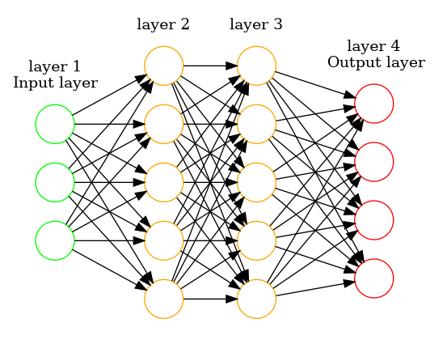

# Notations
## Definitions
| Notation | Definition | Example
| :-: | - | -
| L | Total number of layers | -
| Sl | Number of units in layer l | -
| SL | Number of units in output layer | -
| K | Number of units in output layer | 1&le;K&le;2&ensp;Binary
| | |

## Example
### Neural network

### Notations values
| Notation | Value
| - | -
| L | 4
| S1 | 3
| S2 | 4
| S3 | 5
| S4 / SL | 4
